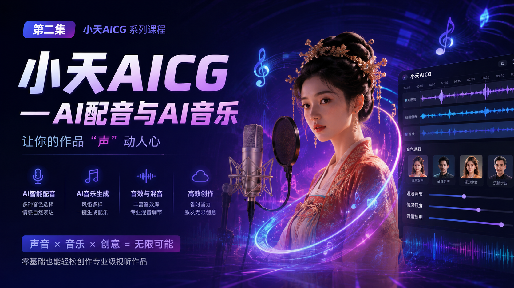
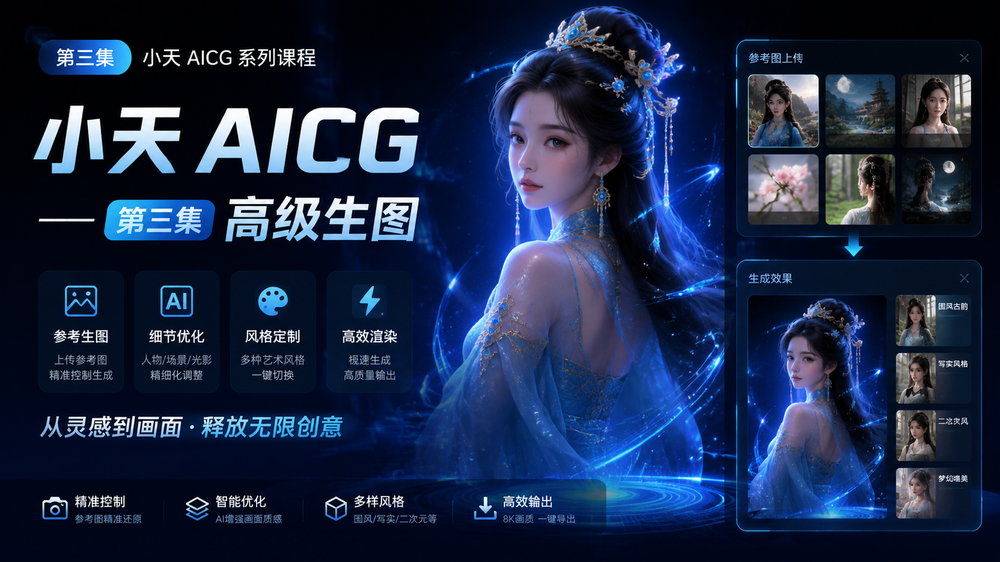
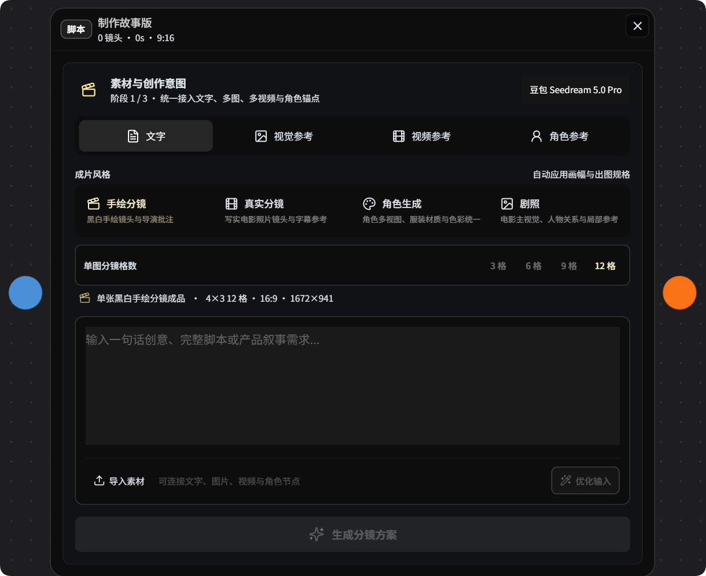
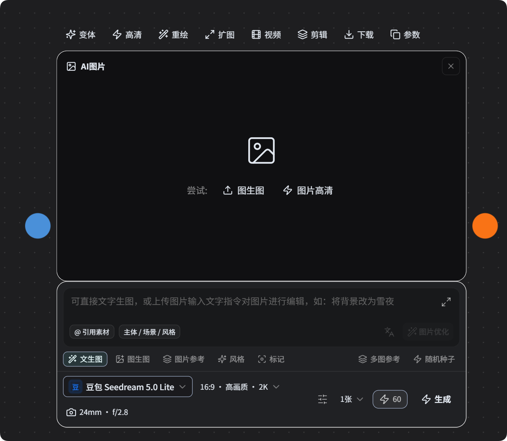
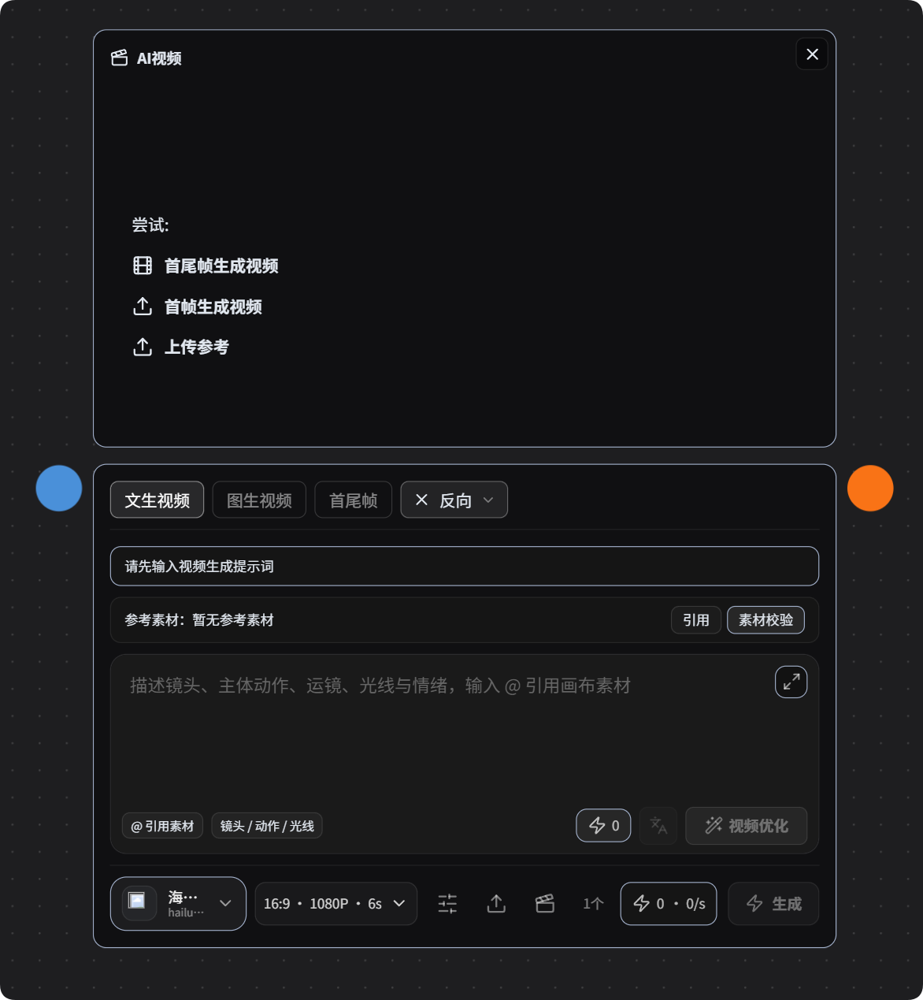

# 小天画布 · AIGC Infinite Canvas

> **开源 · 个人免费商用 · 企业授权商用** · 纯前端 AI 创意工作台
>
> 🌐 **English version available: [README.en.md](./README.en.md)**

[](https://github.com/aa309888654-lang/AIGC-Infinite-Canvas-Generation-Software)

[](https://github.com/aa309888654-lang/AIGC-Infinite-Canvas-Generation-Software)
[](#-授权说明)

一站式 AI 创作平台：**AI 生图 · AI 视频 · AI 配音 · AI 音乐 · 故事板 · 角色设计**。本地优先，一个进程即可启动。

📖 **完整产品介绍（含 11 张 demo 图）**：[`docs/产品介绍.md`](./docs/产品介绍.md)

---

## 🎨 一图速览

<table>
  <tr>
    <td align="center" width="50%">
      <b>4K 高清生图样例</b><br/>
      
    </td>
    <td align="center" width="50%">
      <b>AI 配音 + AI 音乐</b><br/>
      
    </td>
  </tr>
  <tr>
    <td align="center" width="50%">
      <b>高级生图工作流</b><br/>
      
    </td>
    <td align="center" width="50%">
      <b>故事板 / 镜头绘制（4 阶段流程）</b><br/>
      
    </td>
  </tr>
  <tr>
    <td align="center" width="50%">
      <b>AI 图片生成（文/图/参考/风格/标记）</b><br/>
      
    </td>
    <td align="center" width="50%">
      <b>AI 视频生成（文/图/首尾帧/运镜）</b><br/>
      
    </td>
  </tr>
</table>

更多功能截图与样例（4K/2K 汉服主题、角色设计、故事板分镜）见 [`docs/产品介绍.md`](./docs/产品介绍.md)。

---

## ✨ 特性

- **AI 生图**：文生图、图生图、参考生图、风格迁移、随机种子、标记控制、多图参考
- **AI 视频**：文生视频、图生视频、首尾帧生成、首帧生成、运镜/动作/光线控制
- **AI 配音 + AI 音乐**：多音色、风格多样、音效混音
- **故事板 / 镜头绘制**：4 阶段流程、3/6/9/12 格分镜、景别/运镜/情绪/导演批注
- **角色设计 / 人物设定集**：标准视图、表情组、动作、细节、色板、材质
- **无限画布**：节点式自由编排

---

## 🚀 快速开始

要求：Node.js >= 18

```bash
# 1. 克隆仓库
git clone https://github.com/aa309888654-lang/AIGC-Infinite-Canvas-Generation-Software.git
cd AIGC-Infinite-Canvas-Generation-Software

# 2. 安装依赖
npm install

# 3. 启动开发服务器
npm run dev

# 4. 打开浏览器
# 访问 http://localhost:5178
```

更详细的部署与 API Key 配置见 [`docs/产品介绍.md`](./docs/产品介绍.md) 和 [`server/README.md`](./server/README.md)。

---

## 🔧 技术栈

- **前端**：React 19 + Vite + TypeScript + Tailwind CSS
- **后端**（可选）：Node.js + Express + Prisma + SQLite/PostgreSQL
- **AI 模型适配**：豆包 Seedream / SenseNova / StepFun / Agnes / MiniMax / DeepSeek / 智谱 GLM / Vidu / NVIDIA NIM / OpenAI 兼容
- **无限画布**：React Flow / Konva.js / Fabric.js
- **可选客户端**：Electron / Tauri

---

## 📄 授权说明

本项目采用 **Source-Available 商业授权**（详见 [`LICENSE`](./LICENSE) 和 [`LICENSE-COMMERCIAL.md`](./LICENSE-COMMERCIAL.md)）：

| 用途 | 状态 |
|---|---|
| 个人学习、研究、个人创作 | ✅ 免费 |
| 个人 / 非公司主体商用（含发布、获利、二次开发） | ✅ **个人免费商用** |
| 公司、企业、工作室、机构对外提供 SaaS / 产品 / 服务 | ⚠️ 需取得**书面商业授权** |

---

## 💖 赞助支持

如果你觉得这个项目对你有帮助，欢迎扫码赞助支持小天 AICG 持续开发 ✨

> 软件内点击工具栏 ❤️ 按钮，或打开 `设置 → 赞助` 即可看到赞助二维码（金额随心：¥1 糖果 / ¥5 茶 / ¥10 咖啡 / ¥20 短片）。

赞助二维码 `qrcode.webp` 已开源在仓库根目录。

---

## 📚 文档导航

| 文档 | 内容 |
|---|---|
| [`README.md`](./README.md) | 本文件（项目入口） |
| [`docs/产品介绍.md`](./docs/产品介绍.md) | 完整产品功能介绍（含 11 张 demo 图） |
| [`LICENSE`](./LICENSE) | GitHub-recognized license 文件 |
| [`LICENSE-COMMERCIAL.md`](./LICENSE-COMMERCIAL.md) | 商业授权详细条款 |
| [`server/README.md`](./server/README.md) | 后端服务说明 |

---

## 🙏 致谢

感谢所有大模型服务商、第三方依赖和开源贡献者。
