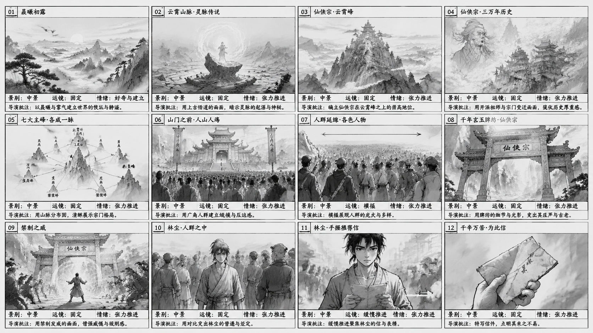
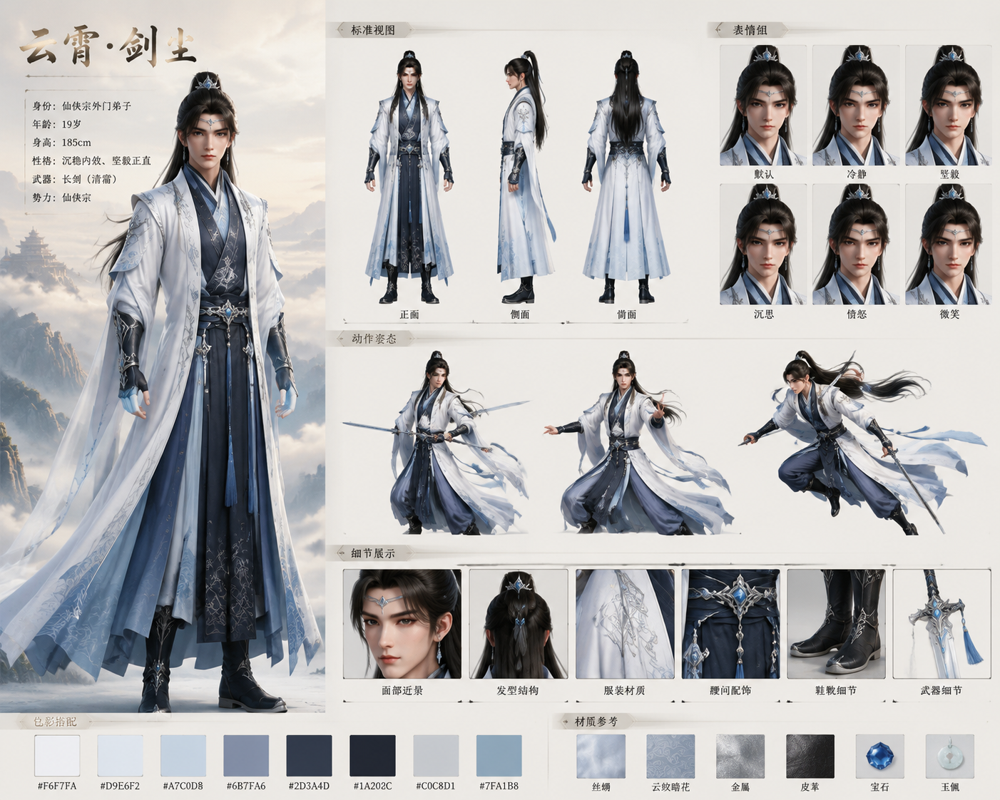
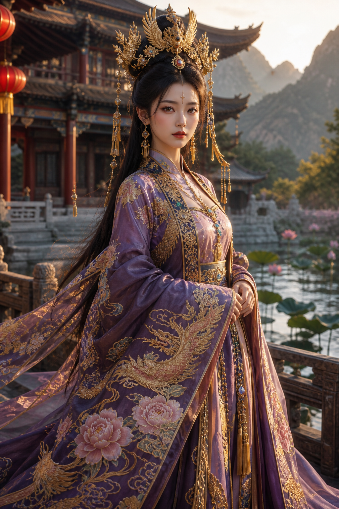
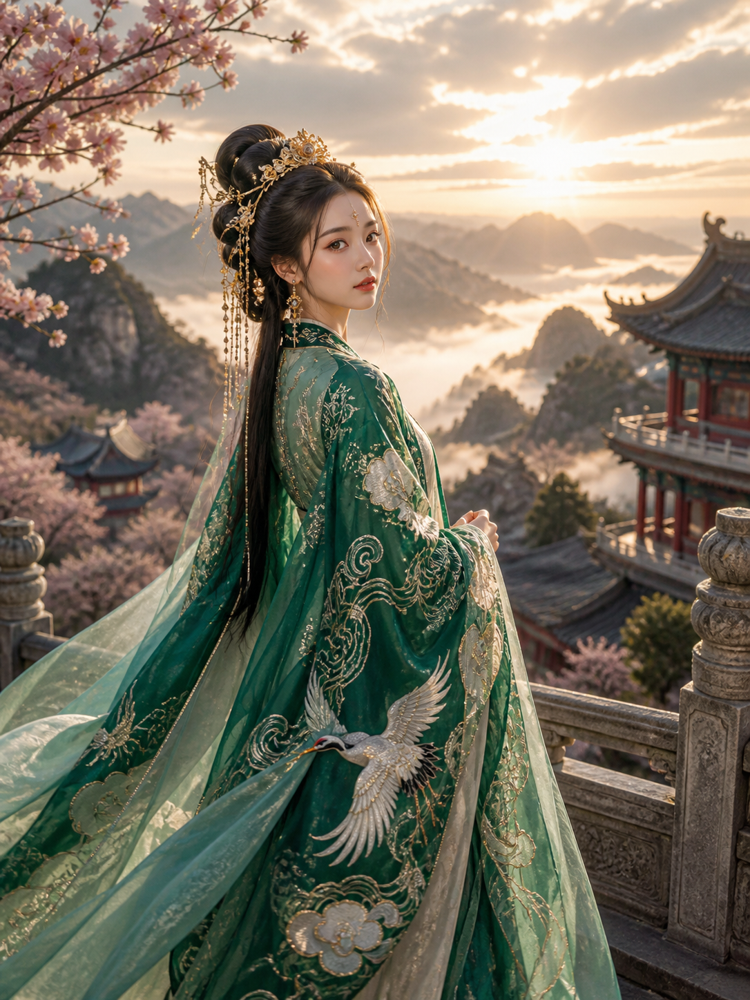
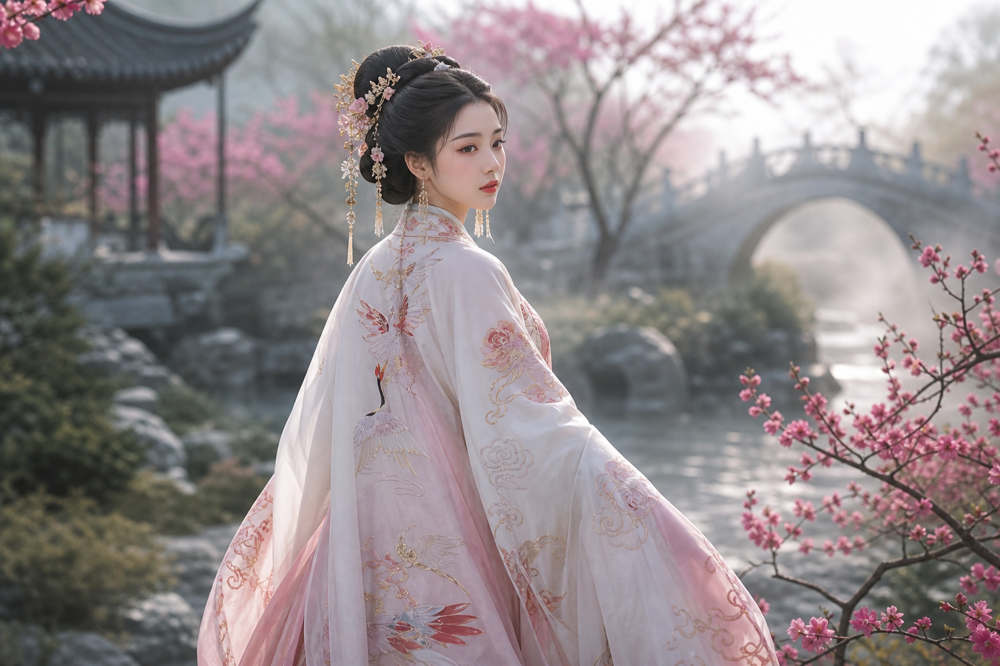

# 小天画布 · 产品介绍

> **AIGC Infinite Canvas** · 纯前端 AI 创意工作台

小天画布是一站式 AI 创作平台，覆盖 **生图 · 生视频 · 配音 · 音乐 · 故事板 · 角色设计** 六大场景。本地优先、一个进程即可启动。

仓库：https://github.com/aa309888654-lang/AIGC-Infinite-Canvas-Generation-Software

---

## 🎨 核心功能

### 1. AI 生图（高级生图）

支持 **文生图、图生图、参考生图、风格迁移、随机种子、标记控制、多图参考** 等多种生成模式。内置主流大模型（豆包 Seedream 5.0 Lite 等），可调 16:9 / 2K 等比例与画质参数。


---

### 2. AI 视频生成

支持 **文生视频、图生视频、首尾帧生成、首帧生成、上传参考** 多种模式：

- **文生视频**：纯文字描述生成短片
- **图生视频**：单张图片作为首帧或参考
- **首尾帧生成**：上传起止两帧，AI 自动补全中间镜头运动
- **首帧生成**：以上传图为起点，AI 续写后续动作
- **运镜/动作/光线控制**：通过 `@引用素材` 与 `镜头/动作/光线` 标签精细化控制
- **视频优化**：自动提升成片画质
- **多模型适配**：海螺 Hailuo 等视频生成模型；可调 16:9、1080P、6s 时长


---

### 3. 高级生图工作流

从参考图到成品的全流程：上传参考图、AI 强化画面质感、多种艺术风格（国风/写实/二次元等）一键切换、8K 高质量输出。


---

### 4. AI 配音 + AI 音乐

- **AI 智能配音**：多种音色选择（温柔女声、磁性男声、活力少女、沉稳大叔等），情感自然表达
- **AI 音乐生成**：风格多样、一键生成配乐
- **音效与混音**：丰富音效库、专业混音调节
- **高效创作**：省时省力、激发无限创意

让你的作品"声"动人心。


---

### 5. 故事板 / 镜头绘制

**4 阶段流程化创作**：素材与创作意图 → 脚本生成 → 分镜分镜生成 → 镜头绘制。

在统一界面中接入 **文字 / 视觉参考 / 视频参考 / 角色参考**，选择成片风格（手绘分镜 / 真实分镜 / 角色生成 / 剧照），指定单图分镜格数（3 / 6 / 9 / 12 格），AI 自动应用画幅与出图规格、生成可继续编辑的分镜方案。


**成片后**：为剧本生成完整的 **分镜脚本**，每一格标注 **景别（中景 / 全景 / 特写）、运镜（固定 / 横摇 / 缓推）、情绪（好奇与建立 / 张力推进）**，并附 **导演批注**。从灵感到画面、释放无限创意。



---

### 6. 角色设计 / 人物设定集

为创作项目建立 **统一、可复用的角色资产**：

- **标准视图**：正面 / 侧面 / 背面
- **表情组**：默认、冷静、坚毅、沉思、愤怒、微笑
- **动作姿态**：动态姿势
- **细节展示**：面部近景、发髻结构、服装材质、腰间配饰、鞋靴细节、武器细节
- **色板搭色**：6-8 个主配色
- **材质参考**：丝绸、云纹暗花、金属、皮革、宝石、玉佩

角色档案一次建立、整部作品复用。



---

### 7. 4K / 2K 高清生图样例

软件在古风 / 国风 / 写实 / 二次元等风格下都能输出 4K 高清成片。以下为软件生成的 **4K 汉服主题样例**：

**红色 · 樱花古建 · 锦鲤池畔**


**紫色 · 金线刺绣 · 荷塘古建**


**绿色 · 仙鹤祥云 · 黄昏山景**


**白色 · 仙鹤刺绣 · 拱桥梅花 · 2K**


---

### 8. 无限画布（节点式创作）

所有上述能力可在 **无限画布** 上以节点方式自由编排、组合、再创作。

---

## 🚀 快速开始

```bash
# 要求：Node.js >= 18
git clone https://github.com/aa309888654-lang/AIGC-Infinite-Canvas-Generation-Software.git
cd AIGC-Infinite-Canvas-Generation-Software
npm install
npm run dev
# 打开 http://localhost:5178
```

详细部署、API Key 配置见 [README.md](../README.md) 和 [server/README.md](../server/README.md)。

---

## 🔧 技术栈

- **前端**：React 19 + Vite + TypeScript + Tailwind CSS
- **后端**：Node.js + Express + Prisma + SQLite/PostgreSQL
- **AI 模型适配**：豆包 Seedream / SenseNova / StepFun / Agnes / MiniMax / DeepSeek / 智谱 GLM / Vidu / NVIDIA NIM
- **无限画布**：React Flow / Konva.js / Fabric.js
- **可选客户端**：Electron / Tauri（桌面打包）

---

## 📄 授权说明

本项目采用 **Source-Available 商业授权**（详见 [LICENSE](../LICENSE)）：

| 用途 | 状态 |
|---|---|
| 个人学习、研究、个人创作 | ✅ 免费 |
| 个人 / 非公司主体商用 | ✅ **个人免费商用** |
| 公司、企业、工作室、机构对外提供 SaaS / 产品 / 服务 | ⚠️ 需取得**书面商业授权** |

联系方式见 [LICENSE-COMMERCIAL.md](../LICENSE-COMMERCIAL.md)。

---

## 🙏 致谢

感谢所有大模型服务商、第三方依赖和开源贡献者。
